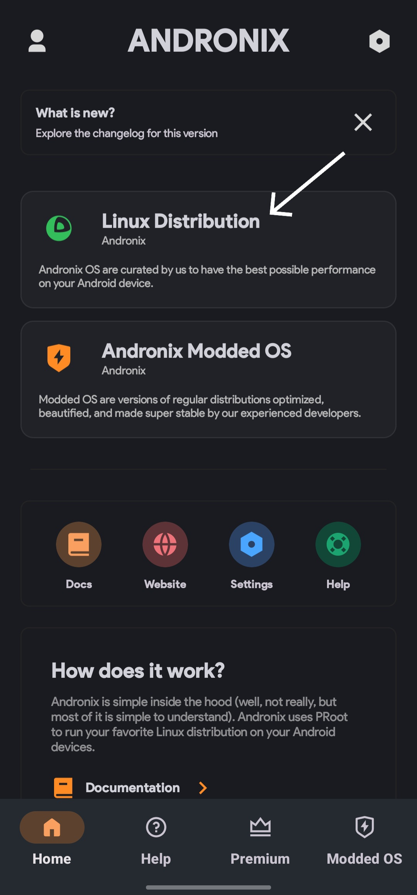

# Kali Linux on Android Without Root - Installation Guide 📱💻

I had faced numerous challenges and failures while attempting to install Kali Linux on my Android device using various methods. After extensive research and experimentation, I finally discovered a solution that worked reliably. 

This repository provides a step-by-step guide on how to achieve this setup using Andronix, Termux, and Real VNC Viewer.

If you found this guide helpful and appreciate the effort put into creating it, please consider giving this repository a star (⭐) on GitHub. Your support means a lot and will help others discover this resource.

## Table of Contents 📋
1. [Prerequisites](#prerequisites)
2. [Installation Steps](#installation-steps)
    a. [Installing Andronix | Termux | RVNC ](#Installing-ANDRONIX-TERMUX-RVNCviewer)
    b. [Setting up Kali Linux](#setting-up-kali-linux)
    c. [Accessing Kali Linux](#accessing-kali-linux)
3. [Troubleshooting](#troubleshooting)
4. [Contributing](#contributing)
5. [License](#license) 

## Prerequisites 🛠️

Before getting started, ensure that you have the following prerequisites:

- An Android device (phone or tablet) with at least 2GB of RAM (4GB or more recommended) 📱
- Sufficient storage space available on your device (around 5GB) 💾
- Android version 10+ 🌐

## Installation Steps 🛠️

### Installing ANDRONIX TERMUX RVNCviewer 📲

[Press Here To Download Andronix](https://play.google.com/store/apps/details?id=studio.com.techriz.andronix&pcampaignid=web_share)

[Press Here To Download Termux](https://play.google.com/store/apps/details?id=com.termux&pcampaignid=web_share)

[Press Here To Download RVNC Viewer](https://play.google.com/store/apps/details?id=com.realvnc.viewer.android&pcampaignid=web_share)

### Open Andronix And Follow Instructions: 💻
Step 1 & 2 :

 </a>
 

Step 3 & 4 :

 </a>
 

Last Step :

</a>
 

### Open Termux And Follow Instructions: 💻

1. Open Termux and Paste the code you copied and press enter (You Have To be online for this to work)
2. After That depending on The Distro You Install , You have a start command like :
   shell
   ''
   ./start-kali.sh
   ''
